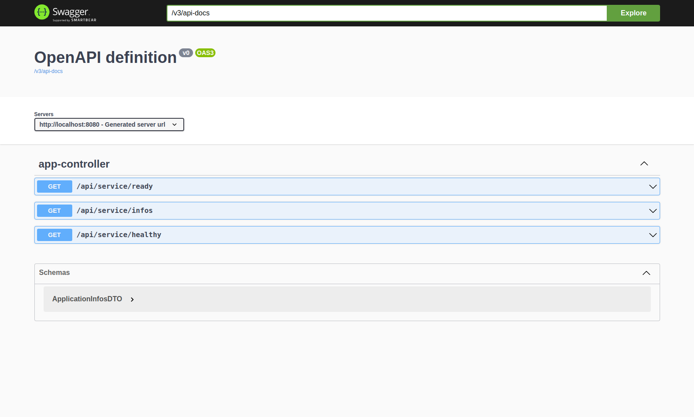

# 🚀 DevFest Dakar 2022 - Demo App 🚀

[](https://img.shields.io/badge/java-3776AB?style=for-the-badge&logo=Java&logoColor=white)
[](https://img.shields.io/badge/spring-3776AB?style=for-the-badge&logo=spring-boot&logoColor=white)
[](LICENSE)
[](https://github.com/ellerbrock/open-source-badges/)

This repo contains the application code of my demo at `DevFest Dakar 2022` on `Continuous Deployment and GitOps in Kubernetes with ArgoCD`.  
The application is basically a REST API built with `Spring Boot` driven by a simple architecture.

## Technical Stack

- `Java`
- `Spring Boot`

## Prerequisites

You need `Java (JDK)` and `Maven` installed on your system.

- [Java](https://www.oracle.com/java/technologies/downloads/)

- [Maven](https://maven.apache.org/download.cgi)

## Usage

You have two ways to set up this project :

### Manual Setup

After cloning the project:

- Edit the `src/main/resources/application.yaml` file if you want

- Go to the root of the project, open a terminal then do `./mvnw clean`

- Still at the root of the project, start the server with `./mvnw spring-boot:run`

- Then go to your browser at: <http://localhost:8080/devfest-demo/docs> 😊

### Docker Setup

After cloning the project:

- Run the following command in order to build a docker image
```bash
docker build -t devfest-dakar-demo-app:develop-2002-01 .
```

- Run the following command in order run a container
```bash
docker run -d -p 8080:8080 --name devfest-dakar-demo-app devfest-dakar-demo-app:develop-2002-01
```

- Then go to your browser at: <http://localhost:8080/devfest-demo/docs> 😊

## API Documentation



## Contributing

Feel free to make a PR or report an issue 😃

Oh, one more thing, please do not forget to put a description when you make your PR 🙂

## Author

- [M.B.C.M](https://itdev.sn)
  [](https://twitter.com/the_it_dev)
